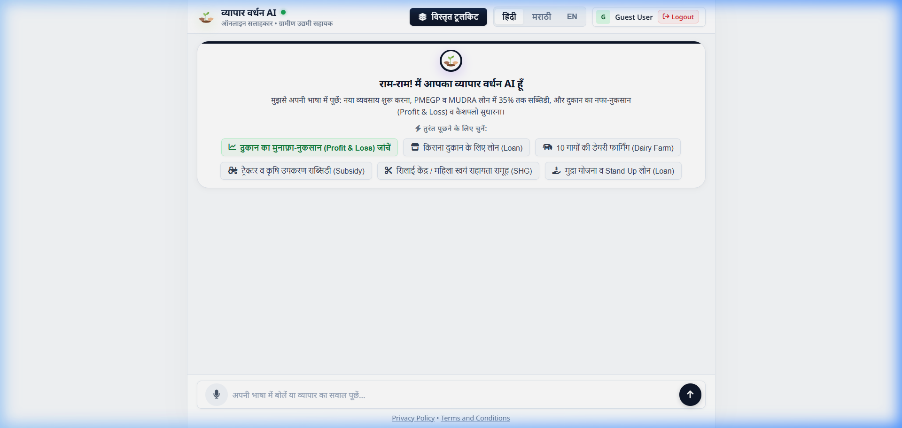
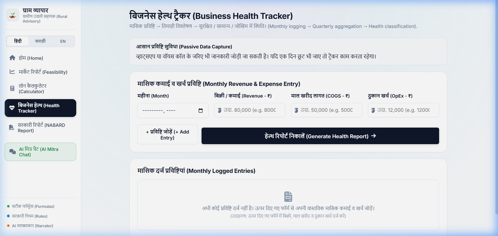
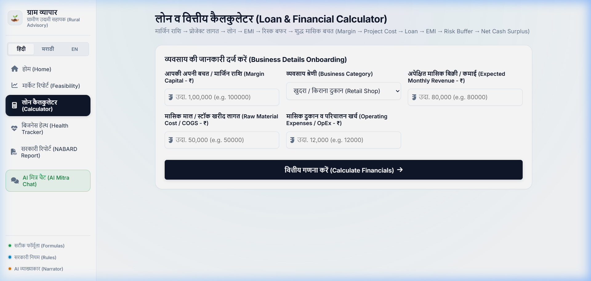
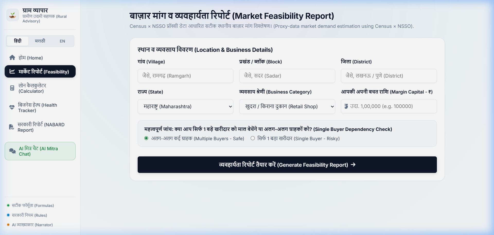

# 🌾 व्यापार वर्धन AI (Vyapar Vardhan AI)
### *Rural Business Advisory Assistant • Hyper-Local Financial Structuring & P&L Diagnostic Platform*

[](https://vyapar-vardhan-ai.onrender.com/)
[](https://nodejs.org/)
[](https://nextjs.org/)
[](https://www.typescriptlang.org/)
[](https://ai.google.dev/)
[](https://firebase.google.com/)

---

## 📌 Overview

**व्यापार वर्धन AI** is an AI-driven, hyper-local business advisory and financial structuring platform crafted specifically for rural micro-entrepreneurs, self-help groups (SHGs), and small shop owners across India.

Traditional credit appraisals often fail rural entrepreneurs who lack formal accounting records. **व्यापार वर्धन AI** bridges this **₹30+ Lakh Crore credit gap** by providing:
1. **Conversational vernacular financial diagnosis** (Hindi, Marathi, English) with voice and text support.
2. **Deterministic, audit-proof financial structuring** (EMI, DSCR, break-even, risk buffer) aligned with NABARD, PMEGP, and MUDRA guidelines.
3. **Hyper-local market demand estimation** powered by Census × NSSO proxy datasets.
4. **Passive business health tracking** to flag early operational risks and maintain ongoing profitability.

---

## 📸 Platform Previews

| 🤖 AI Advisor (AI Mitra Chat) | 📊 Business Profile & Health Tracker |
| :---: | :---: |
|  |  |
| *Conversational P&L diagnostic and scheme advisor with voice input* | *Passive monthly revenue & expense tracking with health classification* |

| 💰 Financial Dashboard (Loan Calculator) | 📈 Local Market Insights (Feasibility Report) |
| :---: | :---: |
|  |  |
| *NABARD-compliant EMI, DSCR, margin capital, and cash surplus calculations* | *Census × NSSO proxy data demand estimation and buyer dependency checks* |

---

## 🏛️ Three-Way Architecture

The platform guarantees trust, accuracy, and defensibility by segregating financial logic into three distinct layers:

```
┌─────────────────────────────────────────────────────────────┐
│                   व्यापार वर्धन AI ARCHITECTURE              │
└─────────────────────────────────────────────────────────────┘
                               │
       ┌───────────────────────┼───────────────────────┐
       ▼                       ▼                       ▼
┌───────────────┐       ┌───────────────┐       ┌───────────────┐
│ DETERMINISTIC │       │     RULES     │       │  VERNACULAR   │
│   FORMULAS    │       │    ENGINE     │       │  AI NARRATOR  │
├───────────────┤       ├───────────────┤       ├───────────────┤
│ • EMI Sizing  │       │ • PMEGP Rules │       │ • Multilingual│
│ • DSCR Ratio  │       │ • MUDRA Shishu│       │   Explanations│
│ • Break-Even  │       │   Kishor/Tarun│       │ • Never fakes │
│ • Risk Buffer │       │ • Health Risk │       │   or estimates│
│ • Net Surplus │       │   Grading     │       │   numbers     │
└───────────────┘       └───────────────┘       └───────────────┘
```

1. **Deterministic Formulas**: Precision financial math without hallucination. All EMI schedules, post-moratorium repayments, and Debt Service Coverage Ratios (DSCR) use standard banking formulas.
2. **Rules Engine**: Automated policy routing matching entrepreneurs against central and state government credit-linked schemes (PMEGP, MUDRA, Stand-Up India, PMFME).
3. **Vernacular AI Narrator**: Conversational multi-turn AI translating complex banking terminology into easy-to-understand explanations in regional languages.

---

## ⚡ Multi-Provider AI Fallback Chain

To ensure 99.9% uptime and zero quota downtime during high usage:
```
Google Gemini 2.5 Flash ──► SambaNova / Fast LLM ──► Local Ollama Model
      (Primary)                    (Secondary)                 (Offline Fallback)
```
If an upstream provider hits free-tier rate limits, the system seamlessly cascades to the next available provider.

---

## 🛠️ Technology Stack

- **Frontend Core**: Semantic HTML5, CSS3 Glassmorphism, Vanilla JS, FontAwesome, Google Fonts (Noto Sans, Inter)
- **App Framework**: Next.js 14, React 18, TypeScript, TailwindCSS
- **Backend**: Node.js HTTP Server (`server.js`) with static asset pipeline and REST APIs
- **Authentication**: Firebase Authentication (Google OAuth, Email/Password, Guest Session Mode)
- **Cloud & Database**: Firebase Firestore + Local persistence layer
- **AI / LLM Integration**: Google Gen AI SDK (`@google/genai`), Google Gemini 2.5 Flash, SambaNova, Ollama
- **Hosting & CI/CD**: Render.com (Auto-deploy on Git push)

---

## 🚀 Quick Start (Local Setup)

### 1. Prerequisites
- [Node.js](https://nodejs.org/) (v18.x or later recommended)
- Git

### 2. Clone the Repository
```bash
git clone https://github.com/Athu-V/Vyapar-Vardhan-AI.git
cd Vyapar-Vardhan-AI
```

### 3. Install Dependencies
```bash
npm install
```

### 4. Configure Environment Variables
Copy `.env.example` to `.env`:
```bash
cp .env.example .env
```
Update your `.env` with your API keys:
```env
PORT=3000
GEMINI_API_KEY="your-google-ai-studio-gemini-api-key"
GEMINI_MODEL="gemini-2.5-flash"

# Optional Firebase Keys
NEXT_PUBLIC_FIREBASE_API_KEY="your-api-key"
NEXT_PUBLIC_FIREBASE_AUTH_DOMAIN="your-project.firebaseapp.com"
NEXT_PUBLIC_FIREBASE_PROJECT_ID="your-project-id"
```

### 5. Start the Application
```bash
npm start
```
Open your browser and navigate to:
```
http://localhost:3000/
```

---

## 🧪 Testing & Verification

```bash
# Run unit and engine tests
npm test

# Verify TypeScript compilation
npm run typecheck

# Build Next.js app bundle
npm run build
```

---

## 🌐 API Endpoints

| Method | Endpoint | Description |
| :--- | :--- | :--- |
| `GET` | `/api/health` | Health check endpoint returning uptime, version, and server status |
| `POST` | `/api/chat` | AI Advisor chat endpoint handling multi-turn vernacular advisory |
| `GET` | `/api/firebase-config` | Exposes public Firebase credentials securely to the client |
| `POST` | `/api/login` | Session login and cookie management |
| `GET` | `/api/me` | Current session verification and user profile status |
| `POST` | `/api/logout` | Session teardown |

---

## 👥 Authors & Team

Developed with pride for the **Smart India Hackathon (SIH)**:

- **Atharva Dalvi** ([@Athu-V](https://github.com/Athu-V))
- **Vedika Borase** ([@borasevedika06](https://github.com/borasevedika06))
- **Anuj Bhokse** ([@anujbhokse10](https://github.com/anujbhokse10))
- **Shreya** ([@shreya260122](https://github.com/shreya260122))

---

## 📄 License

This project is licensed under the [MIT License](LICENSE) — free to use, modify, and distribute for educational and developmental purposes.
